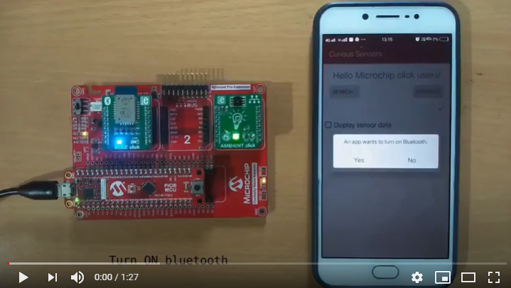
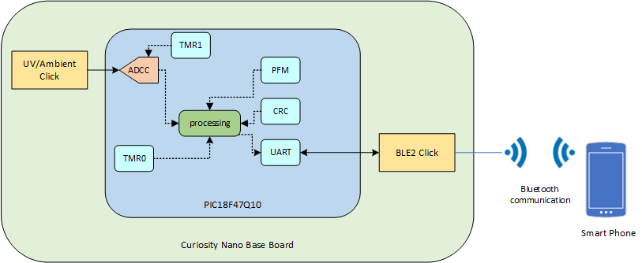
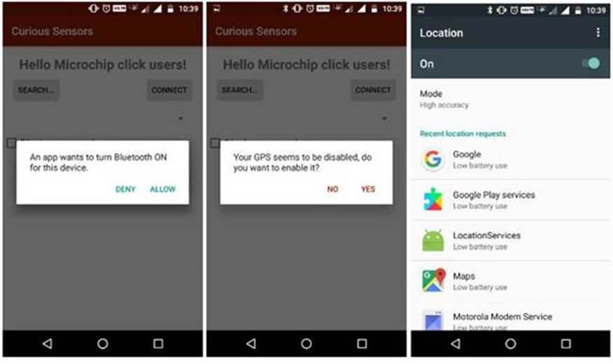
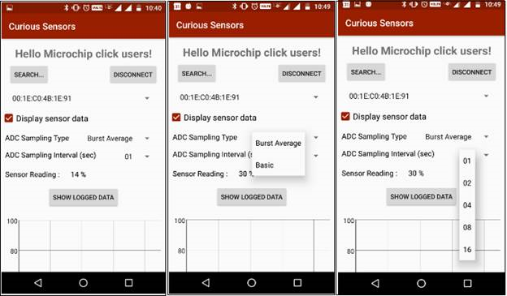
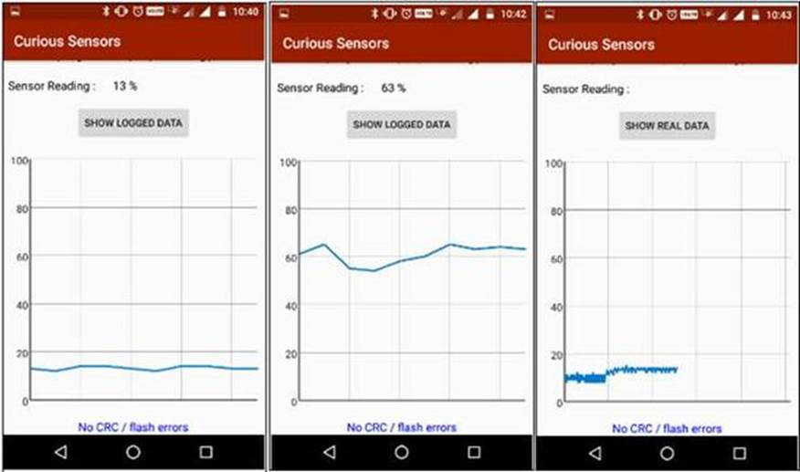
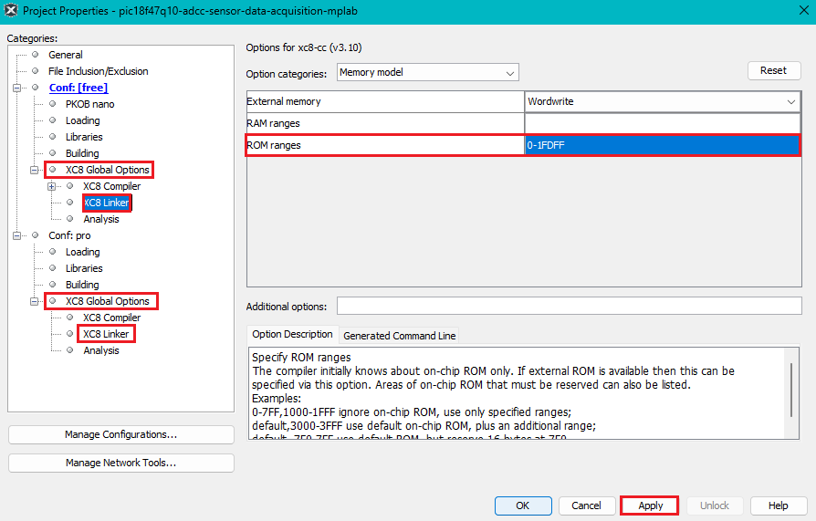

<!-- Please do not change this html logo with link -->

## Sensor Data Acquisition Using 10-bit ADCC

## Introduction

The PIC18-Q10 family is equipped with a 10-bit Analog-to-Digital Converter with Computation (ADCC) which automates Capacitive Voltage Divider (CVD) techniques for advanced touch sensing, averaging, filtering, oversampling and performing automatic threshold comparisons. A key feature that distinguishes the PIC18F-Q10 family MCUs within the PIC18F devices is their ability to write a single byte of data to program memory without requiring to erase an entire sector. Writes to program memory can be performed by sector or by individual word, while reads from program memory are performed one byte at a time. Furthermore, they have programmable Cyclic Redundancy Check (CRC) with Memory Scan, which is a Core Independent Peripheral (CIP) used to calculate CRC over a portion of Flash memory or EEPROM without needing the user to input data to the CRC data registers.

Click the image below to view the demo operation video of this example.

 

## Related Documentation

- [PIC18F47Q10 Product Page](https://www.microchip.com/en-us/product/PIC18F47Q10?utm_source=GitHub&utm_medium=TextLink&utm_campaign=MCU8_PIC18-Q13&utm_content=pic18f47q10-adcc-sensor-data-acquisition-mplab-github&utm_bu=MCU08")
- [PIC18F47Q10 Data Sheet](https://ww1.microchip.com/downloads/en/DeviceDoc/PIC18F27_47Q10-data-sheet-40002043C.pdf)
- [PIC18F47Q10 Code Examples on GitHub](https://github.com/microchip-pic-avr-examples?q=PIC18F47Q10&type=&language="PIC18F47Q10")

## Hardware Used

- [PIC18F47Q10 Curiosity Nano](https://www.microchip.com/en-us/development-tool/DM182029?utm_source=GitHub&utm_medium=TextLink&utm_campaign=MCU8_PIC18-Q10&utm_content=pic18f47q10-adcc-sensor-data-acquisition-mplab-github&utm_bu=MCU08)
- [Curiosity Nano Base for Click boards™](https://www.microchip.com/en-us/development-tool/AC164162?utm_source=GitHub&utm_medium=TextLink&utm_campaign=MCU8_PIC18-Q10&utm_content=pic18f47q10-adcc-sensor-data-acquisition-mplab-github&utm_bu=MCU08)
- [UV Click](https://www.mikroe.com/uv-click) or [Ambient Click]( https://www.mikroe.com/ambient-click)
- [BLE2 Click](https://www.mikroe.com/ble-2-click)

## Software Used

- [MPLAB® X IDE v6.30](https://www.microchip.com/en-us/tools-resources/develop/mplab-x-ide?utm_source=GitHub&utm_medium=TextLink&utm_campaign=MCU8_PIC18-Q10&utm_content=pic18f47q10-adcc-sensor-data-acquisition-mplab-github&utm_bu=MCU08) or newer
- [XC8 Compiler v3.10](https://www.microchip.com/en-us/tools-resources/develop/mplab-xc-compilers?utm_source=GitHub&utm_medium=TextLink&utm_campaign=MCU8_PIC18-Q11&utm_content=pic18f47q10-adcc-sensor-data-acquisition-mplab-github&utm_bu=MCU08) or newer
- [MPLAB Code Configurator (MCC) v5.7.0](https://www.microchip.com/en-us/tools-resources/configure/mplab-code-configurator?utm_source=GitHub&utm_medium=TextLink&utm_campaign=MCU8_PIC18-Q12&utm_content=pic18f47q10-adcc-sensor-data-acquisition-mplab-github&utm_bu=MCU08) or newer
- [Microchip PIC18F-Q Series Device Support v1.30.487](https://packs.download.microchip.com/) or newer

## Android™ OS Version

* The android app is developed using Android OS version **Marshmallow (v6.0.1) API level 23**
* The app supports Android versions from **Jelly bean v4.3.x (API level 18)** to **Oreo v8.0.0 (API level 26)**
* The apk file for the Android app is available in the project files for downloading

## Description

This example highlights the usage of the word-writable feature of the on-chip Flash memory, which does not erase the complete sector, ADCC and CRC modules of the PIC18F47Q10 MCU. Here, the ADCC module operates either in Basic mode or Burst Average mode. The CRC module with the integrated Memory Scanner feature is used for Program Flash Memory (PFM) data integrity.

An Android app is developed with which users can visualize the sensor data over time. The instantaneous data visible on the app is from ADCC, and the logged data is from Flash memory. This example uses the Curiosity Nano base for Click boards with the UV Click board or Ambient Click board, and a BLE2 Click board from MikroElektronika.

The figure below shows the block diagram view of the application.   

The PIC18F47Q10 ADCC module  periodically acquires the UV Sensor or Ambient sensor data and processes it to the equivalent digital data. The ADCC is used with the Auto Trigger option by setting Timer1 (TMR1) as source. The ADC mode and the Timer1 interval can be selected from the Android app. Currently, the available options for the interval are 1, 2, 4, 8 or 16 seconds.

In this example, the ADCC is used in the Basic mode or Burst Average mode. The averaging of 32 samples is done by the computation hardware of the ADCC and the result is available in the ADFLT register. The processed data will be transmitted to a mobile over Bluetooth® Low Energy (BLE) communication and displayed on the Android mobile app.

If the Bluetooth is not connected, the sensor data acquired by the ADC is periodically stored in PFM using the single-word write feature of the PFM. When the Bluetooth is connected, the logged data is transmitted to the mobile app. The CRC with memory scanner peripheral is used to do error checking of data stored in PFM for data integrity.

In this application, the MCU communicates with the BLE2 Click board over the Universal Asynchronous Receiver and Transmitter (UART) communication interface. This application uses the ADCC, CRC with memory scanner, PFM and UART modules of the MCU.

## Hardware Setup

1. Insert the BLE2 Click board in mikroBUS™ slot 1 of the Curiosity Nano base board.

2. This demo uses the UV Click analog output. Resolder the Analog-to-Digital (A/D) SEL jumper J1 (zero-ohm resistor) on the UV Click board to the AN position to use the analog output. By default, the jumper is soldered in the ADC position.

3. Insert the UV/Ambient Click board in mikroBUS slot 3 of the Curiosity Nano base board.

The following table shows the list of PIC18F47Q10 port pins used in the example along with the signal names.

|Sr No. | PIC18F47Q10 Pin|Signal Name| Board|
| :---------: |:----------:|:-----------:|:-----------:|
| 1     | RA2    | Analog input | AN output from UV/Ambient Click |
| 2     | RD5    | Sensor EN    | UV/Ambient Click                |
| 3     | RA0    | Conn         | BLE2 Click                      |
| 4     | RA7    | Wake         | BLE2 Click                      |
| 5     | RC3/RX | UART RX	    | BLE2 Click                      |
| 6    	| RC2/TX | UART TX    	| BLE2 Click            	        |
| 7     | RA3    | CMD/MLDP     | BLE2 Click                      |

## Operation

1. Power on the PIC18F47Q10 Curiosity Nano board using a USB micro cable connected to the PC.
2. Program the PIC18F47Q10 MCU on Curiosity Nano board.
3. The UV LED torch light can be used to check how the UV sensor on the UV Click board works.

#### Curiosity Nano Base for Click boards with UV, BLE2 Click board and UV light source

  

  

#### Curiosity Nano Base for Click boards with Ambient and BLE2 Click boards

  

4. Install the Curious Sensors Android app on the mobile.

    - Allow the application to turn on the mobile Bluetooth service. Ignore this step if Bluetooth is already turned on in the mobile.

    - Enable the GPS service and turn on the location service in the mobile. Ignore this step if the Location service is already turned on in the mobile.

    

    - Pressing the **SEARCH** button starts the scan of nearby BLE devices. Once the search operation is done, the GUI lists the detected devices. The user should select the BLE device used for the application from the list and press the **CONNECT** button to pair with the device.

    

    - To view the sensor data, check the “Display sensor data” option in the GUI. The ADC mode, such as Basic Mode or Burst Average Mode, can be selected from the drop-down menu of “ADC Sampling Type”. The timer interval can be selected from the "ADC sampling interval" drop-down menu with the available options: 1, 2, 4, 8, or 16 seconds.

    

    - The real-time sensor reading is displayed in percentage and the graph of the readings is plotted. The Y-axis shows a percentage vale of light intensity. To view the previous logged data from the PIC18F47Q10 PFM, press the **Show Logged Data** button. The button will then turn into **Show real data** and the graph of the logged data is plotted. If there are any errors in the CRC calculations or Flash read/write, the corresponding error message is displayed at the bottom.

    

## Peripheral Configuration

This section explains how to configure the peripherals using MPLAB X IDE with MCC plug-in to recreate the project.

Refer to the [Software Used ](https://github.com/microchip-pic-avr-examples/pic18f47q10-adcc-sensor-data-acquisition-mplab#software-used) section to install required tools to recreate the project.

Additional information can be found here: [MCC Melody Technical Reference](https://onlinedocs.microchip.com/v2/keyword-lookup?keyword=MCC.MELODY.INTRODUCTION&version=latest&redirect=true)

| Module | Configuration | Usage |
|--------|----------------|----------------|
| Clock control | *Clock Settings*   Clock Source —  HFINTOSC    HF Internal Clock —  64 MHz    Clock Divider —  1  | System Clock|
|Configuration Bits|*CONFIG1L*  External Oscillator Mode Selection —  Oscillator not enabled | RA7 pin   (this pin is used as the external oscillator pin by default)
|ADCC | *Software Settings*  TMR Dependencey selector —  TMR1    *Hardware Settings*  Enable ADC  Result Alignment — Right  Auto-conversion Trigger — TMR1    *ADC Clock*  Clock Source —  FOSC/ADCLK Clock Divider —  FOSC/128    *Computation Settings*  computation Mode —  Burst Average  Sample Repeat Count —  32   Threshold Interrupt Mode —  Enabled   Accumulator Right Shift —  5   *Interrupt Settings*  Threshold Interrupt Enable —  Enable |   Samples output           
|Timer1|*Software Settings*   Custom Name —  TIMER1   *Hardware Settings*  Timer Enable —  Enable   *Timer Clock*  Clock Source — LFINTOSC   prescaler —  1:8 External Clock Synchronization —  Synchronize    *Timer Period*  Requested period —  1s    *Interrupt Settings*  TMR Interrupt Enable — Enable| ADC Auto-conversion Trigger|
|Timer0|*Software Settings*   Custom Name — TIMER0   *Hardware settings*  Clock Prescaler —  1:4096   postscaler —  1:16   Timer Mode —  8 bit   Clock Source —  FOSC/4   Requested Period —  1s     *Interrupt Settings*  TMR interrupt Enable — Enable |Trigger CRC |
|CRC| *Hardware settings*   Enable CRC — Enable    use Pre-defined polynomial — Enable   Pre-defined polynomial —  CRC-16   Polynomial Word Width —  16 Augmentation Mode —  Data augmented with 0s   Shift Direction —  Shift left   Data Words Width —  16     *Scanner*    Enable Scanner  Memory access mode —  Burst Mode   | Error check of data stored in PFM  |
|NVM|*Flash Software Settings*   Generate Flash APIs — Enable    *EEPROM Software Settings*   Generate EEPROM APIs —  Enable | EEPROM |
|UART |*Dependency Selector*   UART PLIB Selector —  EUSART 1    *Configuration Settings*   Custom Name — BLE_UART   Requested Baud Rate —  115200   *Interrupt Settings*   Interrupt driven —  Enable   Software Transmit Buffer Size —  8   Software Transmit Buffer Size —  8 | Send data to PC terminal|

  The following table details the pin configuration for the Pins peripheral in the Pins window.

|Peripheral | Function | Pin Name | Pin Direction | Custom Name |Analog | Start High | Slew Rate | Interrupt on Change|
|-----------|----------|----------|---------------|-------------|------------|---------|---------|--------------------|
| EUSART1 | TXD | RC2 | Output | IO_RC2 | No | Yes | Yes| None |
| EUSART1 | RXD | RC3 | Input  | IO_RC3 | No  | No | Yes | None |
| ADC     | ANx | RA2 | Input  | SENSOR_CLICK_AN | Yes  | No | Yes | None | 
| Pins    | GPIO| RA3 | Output | BLE_CMD | No  | No | Yes | None| 
| Pins    | GPIO| RA0 | Input  | BLE_CONNECTION   | No  | No | Yes | None |
| Pins    | GPIO| RA7 | Output | BLE_WAKE   | No  | No | Yes | None |
| Pins    | GPIO| RD5 | Output | SENSOR_ENABLE   | No  | No |Yes | None |

### Compiler Settings

The below setting is to let the compiler know that the Program size should not exceed the given range of address.
- Go to Project Properties
- Under XC8 Global Options, click XC8 linker
- From the drop-down menu of "Option Categories", select Memory Model
- In the "Rom Ranges" field, enter "0-1FDFF"
- Click **Apply**

## Conclusion

This demo showcases a code example for interfacing a sensor with the PIC18F47Q10 microcontroller, highlighting the usage of its advanced ADCC peripheral. Additionally, the CRC module is employed to regularly verify the integrity of the logged data, ensuring it remains free from corruption. The demonstration also features the word write functionality, which allows for data to be written directly to the program Flash memory without the need to erase the entire sector, illustrating an efficient method of data handling within the application.
