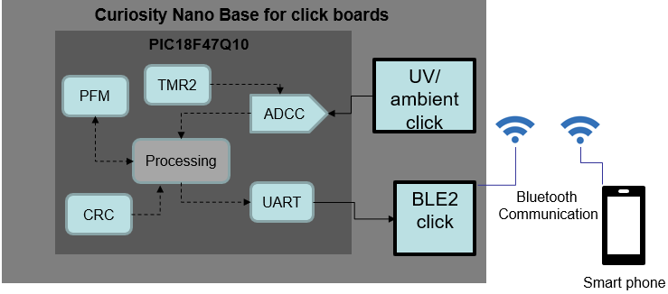
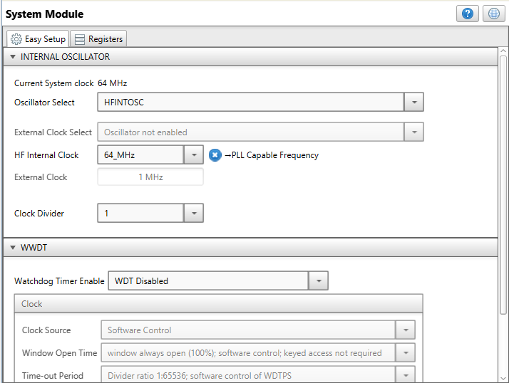
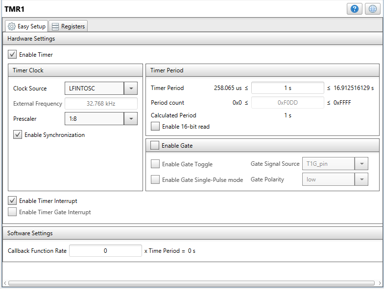
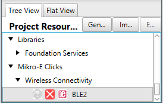
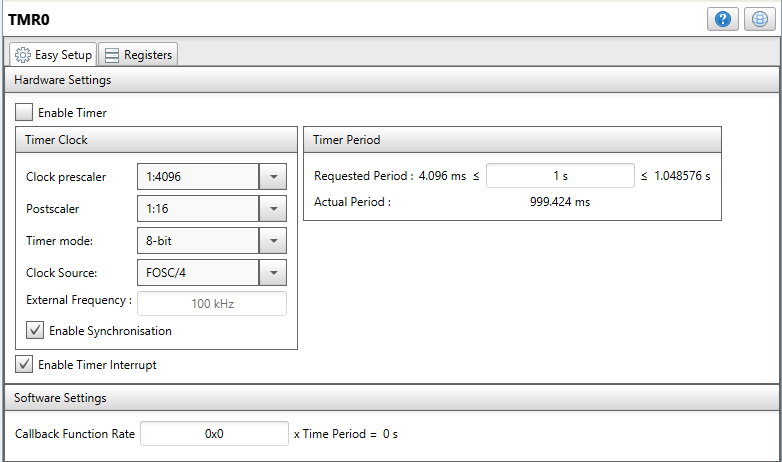
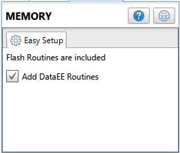
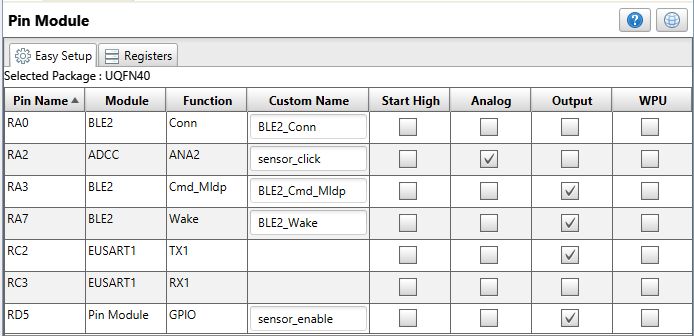

<!-- Please do not change this html logo with link -->

## Sensor Data Acquisition using ADCC

## Introduction
  
The PIC18FxxQ10 family is equipped with a 10-bit ADC with Computation (ADCC) automating Capacitive Voltage Divider (CVD) techniques for advanced touch sensing, averaging, filtering, oversampling and performing automatic threshold comparisons.

PIC18FxxQ10 family has the capability to store 1 byte data at a time to program memory without erasing it. So, no need to erase 64 Bytes in a sector to store 1 byte of data. This feature is not there in any other PIC18F devices. A write to program memory can be executed by sectors or single words. A read from program memory is executed one byte at a time.

The PIC18FxxQ10 family offers core independent peripheral programmable CRC with Memory Scan which can be used for reliable data/program memory monitoring for Fail-Safe operation (e.g., Class B), to calculate CRC over any portion of Flash or EEPROM. The CRC module can be used in high-speed or background operation modes.

## Useful Links

- [PIC18F47Q10 Product Page](https://www.microchip.com/wwwproducts/en/PIC18F47Q10 "PIC18F47Q10 Product Page")
- [PIC18F47Q10 Code Examples on GitHub](https://github.com/microchip-pic-avr-examples?q=PIC18F47Q10&type=&language= "PIC18F47Q10 Code Examples on GitHub")

## Description

This example highlights the usage of ADCC, CRC modules of PIC18F25Q10 MCU and word writable feature of on-chip flash memory, without erasing complete sector.

In this demo, the ADCC module operates either in Baisc or Burst average mode. The CRC module with memory scanner feature is used for PFM data integrity.

An Android App is developed with which users can visualize the sensors data over time. The instantaneous data visible on the app is from ADCC and the logged data is from Flash memory. This example uses the Curiosity HPC board with the UV-Click board or Ambient Click board and a BLE2 Click board from MikroElektronika.

## Sensor Data Acquistion using ADCC:

This example project is targeting the sensor node segment. Figure below shows the block diagram view of the application.

  

 

The ADCC module of PIC18F25Q10 MCU periodically acquires the UV/Ambient sensor data and process it to equivalent digital data. The ADCC has auto conversion trigger option. In this example Timer 1 is used as a source for the ADC conversion trigger. The interval for the timer can be selected from android app; currently the available options for the interval are 1, 2, 4, 8 or 16 seconds.

Out of various computation features of the ADCC such as Averaging and low-pass filter functions, reference comparison, 2-level threshold comparison and selectable interrupts the ADCC is used in the burst average mode in this example. The averaging of 32 samples is done by the computation hardware in the ADCC and the result is available in ADFLT register. The processed data will be transmitted to a mobile over BLE communication and displayed on the android mobile app.

The sensor data acquired by the ADC is periodically stored in PFM using single word write feature of the PFM, when it is not connected to the Bluetooth. When the Bluetooth connection is available, the logged data is then transmitted to the mobile app.

The CRC and memory scanner peripheral is used to do error checking of data stored in PFM for data integrity.

In this application, the MCU communicates with the BLE2 click board over UART communication interface. This application uses ADCC, CRC and memory scanner, PFM and UART modules of the MCU.

## Hardware used

* [PIC18F47Q10 MCU](https://www.microchip.com/wwwproducts/en/PIC18F47Q10 "PIC18F47Q10 MCU")
* [PIC18F47Q10 Curiosity Nano](https://www.microchip.com/Developmenttools/ProductDetails/DM182029 "PIC18F47Q10 Curiosity Nano") 
* [Ultra Violet click](https://www.mikroe.com/uv-click "Ultra Violet click")
* [Ambient click]( https://www.mikroe.com/ambient-click "Ambient click")
* [BLE2 click](https://www.mikroe.com/ble-2-click "BLE2 click")

## Software tools
- [MPLAB X IDE v5.40](https://www.microchip.com/mplab/mplab-x-ide "MPLAB X IDE v5.40")
- [XC8 Compiler v2.30](https://www.microchip.com/mplab/compilers "XC8 Compiler v2.30")
- [MPLAB Code Configurator](https://www.microchip.com/mplab/mplab-code-configurator "MPLAB Code Configurator")

***Note: For running the demo, the installed tool versions should be the same or later. This example is not tested with the previous versions.***

## Android OS version:

* The android app is developed using Android OS version **Marshmallow (6.0.1) API level 23**.
* The app supports android versions from **Jelly bean 4.3.x (API level 18)** to **Oreo 8.0.0 (API level 26)**.
* The apk file for the android app can be downloaded here:[Curious Sensors.apk](https://microchiptechnology-my.sharepoint.com/personal/namrata_dalvi_microchip_com/_layouts/15/onedrive.aspx?id=%2Fpersonal%2Fnamrata%5Fdalvi%5Fmicrochip%5Fcom%2FDocuments%2FEXT%5FCurious%20Sensors%2Eapk&parent=%2Fpersonal%2Fnamrata%5Fdalvi%5Fmicrochip%5Fcom%2FDocuments&originalPath=aHR0cHM6Ly9taWNyb2NoaXB0ZWNobm9sb2d5LW15LnNoYXJlcG9pbnQuY29tLzp1Oi9nL3BlcnNvbmFsL25hbXJhdGFfZGFsdmlfbWljcm9jaGlwX2NvbS9FUlc0aUZBcGY0cEZ1YjVQX0c2aUczUUJCdHdqZEh2Y2xkaWRzdW4xb3F2aHRRP3J0aW1lPWpuS1BmcGRKMkVn "Curious Sensors.apk")

## MCC settings

This section shows the settings used in the demo/example for various MCU modules configuration. These settings were done using the Microchip Code Configurator (MCC). Open MCC to look at the settings of the modules.

## System Module

In “Registers” view, RSTOSC is configured as HFINTOSC with HFFRQ = 64 MHz and CDIV = 1:1

  

## ADCC settings

Selected ADC clock source as FOSC/ADCLK, Clock as FOSC/128, Auto-conversion Trigger as TMR1. In computation feature selected “Repeat” value as 32 for ADC to take average of 32 samples in burst average mode. The Acc Right Shift value is set as 5. Enabled the ADC Threshold interrupt.

  

## ADCC pins:

Selected RA0 and RA2 as analog input pins corresponding to the potentiometer on curiosity HPC board and analog output of UV/Ambient Click board respectively.

  

## Timer 1 settings:

The clock source for timer 1 is selected as LFINTOSC along with the prescaler of 1:8 and the timer period is set as 1 second. The timer interrupt is enabled.

  

Selected BLE2 form Device Resources -> Mikro-E Clicks-> Wireless Connectivity -> BLE2. In BLE2 Configuration tab disabled Generate Example option.

  

  

Under advanced settings, selected EUSART1 which will select normal EUSART1 module (not the foundation service)

  

## EUSART settings

Selected Baud Rate as 115200.

  

## CRC settings:

Data word is 16 bits and the CRC polynomial used is CRC-16.

  

## Timer 0 settings:

Selected Clock prescaler as 1:4096, postscaler as 1:16 and Timer mode as 8-bit. The timer period is set as 1 second and the Timer Interrupt is enabled.

  

## Memory settings:

Enabled the option to Add DataEE Routines.

  

## Full pin settings:

  

## Hardware setup

1. Connect BLE2 click board in mikroBUS slot 1 of the curiosity HPC board.

2. Analog output from UV click is used in this demo. On UV click board resolder the A/D SEL jumper J1 (zero-ohm resistor) to AN position to use analog output. By default, the jumper is soldered in the ADC position.

3. Connect UV/Ambient click board in mikroBUS slot 2 of the curiosity HPC board.

4. Following table shows the list of port pins of PIC18F25Q10 device used in the example along with the signal names.

|Sr No. | PIC18F47Q10 Pin|Signal Name| Board|
| :---------: |:----------:|:-----------:|:-----------:|	
| 1     | RA2    | Analog Input | AN output from UV/Ambient click |
| 2     | RD5    | Sensor EN    | UV/Ambient click                | 
| 3     | RA0    | Conn         | BLE2 Click                      | 
| 4     | RA7    | Wake         | BLE2 Click                      | 
| 5     | RC3/RX | UART RX	| BLE2 Click                      | 
| 6    	| RC2/TX | UART TX    	| BLE2 Click            	  | 
| 7     | RA3    | CMD/MLDP     | BLE2 Click                      |

## Operation

1. Power on the curiosity HPC board using USB micro cable connected to the PC.
2. Program the PIC18F25Q10 device on curiosity HPC board using onboard programmer.
3. The UV LED torch light can be used to check the working of UV sensor on the UV click board.

### Curiosity HPC with UV, BLE2 Click boards and UV light source:

  

  

### Curiosity HPC with Ambient and BLE2 Click boards:

  

4. Install the android app (Curious Sensors) on the mobile.

### Mobile application setup and images:

5. Allow the application to turn on the Bluetooth service of the mobile. Ignore this step if Bluetooth is already turned on in the mobile.

6. Enable the GPS service and turn on the location service in the mobile. Ignore this step if Location service is already turned on in the mobile.

  

7. The GUI consists of a “Search” button, the user presses that to scan all nearby BLE devices. Once the search operation is done, it lists the device. The user should select one of the BLE devices from the list, and press the “Connect” button to pair with the device. Once connected to the device the connect button will appear as “Disconnect”.

  

8. To view the sensor data, check the “Display sensor data” option in the GUI. The ADC mode such as Normal or Burst average mode can be selected from the drop-down menus of “ADC Sampling Type”. The ADC sampling interval can be selected as 1, 2, 4, 8, or 16 seconds.

  

9. The real-time sensor reading is displayed in the percentage and the graph of the readings is plotted. The Y-axis shows the light intensity in terms of percentage. To view the previous logged data from the PFM of PIC18F25Q10 press button “Show Logged Data”. The button then will turn in to “Show real data” and the graph of the logged data is plotted. If there are any errors in CRC calculations or FLASH read/write, the corresponding error message is displayed at the bottom.

  

## Conclusion

This demo provides a code example of interfacing a sensor with PIC18F25Q10 device and usage of its advanced ADC with computation peripheral. The advanced analog peripheral ADCC replaces common software tasks with hardware solution reducing the amount of software code needed. It performs advanced calculations and filtering of data in hardware without any intervention from the CPU which reduces design efforts and improves system response.

The CRC module periodically checks the integrity of the logged data to check for any data corruption. Also, the word write feature without a need to erase whole sector of the program flash memory is demonstrated in the application.

Integrated analog and peripheral interconnectivity promotes autonomous control and reduces external connections and BOM. The core independent operation allows the CPU to either execute more complex tasks, supervise the system or remain in a low-power mode to conserve power until processing is required.

